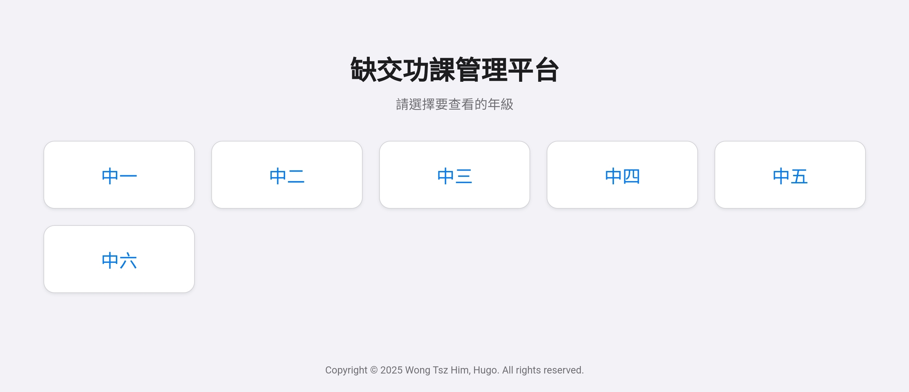
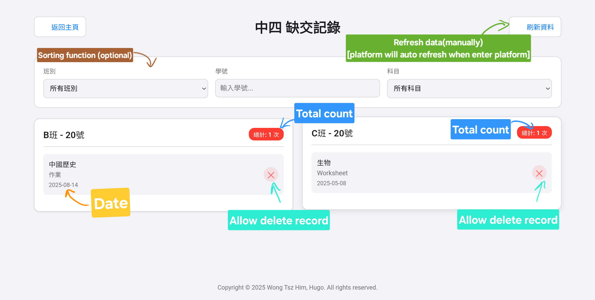

# 缺交功課管理平台 (Homework Submission Tracking Platform)

一個基於 Google Apps Script 建立的全方位、即時、自動化的缺交功課管理解決方案。旨在取代傳統手動、滯後的 Excel 表格流程，為老師和班主任提供一個高效、直觀的管理工具。

---

## ✨ 核心功能 (Features)

*   **⚡ 即時數據同步**：老師透過 Google Form 提交記錄後，平台網頁的數據會立即更新，無需經過 Google Sheet 作為中介。
*   **👨‍👩‍👧‍👦 批量輸入**：老師可以一次性勾選所有欠交功課的學生，只需提交一次表單即可完成多筆記錄，極大提升效率。
*   **🏫 按年級劃分**：Google Form 和平台都為每個年級提供專屬的頁面和科目列表，避免混淆，操作更清晰。
*   **📱 全方位響應式設計**：精心設計的 UI/UX，確保在手機、平板和電腦上都有一致且卓越的瀏覽和操作體驗。
*   **🔍 強大篩選功能**：班主任可以根據班別、學號（模糊搜索）和科目快速篩選，精準定位所需資訊。
*   **🔗 實用工具整合**：儀表板內建「查看學生名單」和「開啟記錄表單」的快捷按鈕，方便老師日常操作。
*   **🎨 現代化介面**：採用專業的 UI 設計、流暢的 CSS 動畫和清晰的 SVG 圖示，提供愉悅的使用體驗。
*   **🔐 零伺服器架構**：完全基於 Google 生態系統，無需額外伺服器成本，安全且易於維護。

---

## 🚀 快速開始 (Getting Started)

請按照以下步驟來完整部署和設定此平台。

### 前提條件

*   一個 Google 帳戶 (建議使用學校的 Google Workspace 帳戶)。

### 安裝步驟

1.  **建立 Google Apps Script 專案**
    *   前往 [Google Apps Script](https://script.google.com/home/start)。
    *   點擊左上角的「**新專案**」，並將其命名為「缺交功課管理平台」。

2.  **貼上後端程式碼**
    *   在編輯器中，您會看到一個名為 `Code.gs` 的檔案。
    *   刪除其中的所有預設內容，然後將您提供的 `Code.gs` 檔案的**完整內容**複製並貼上。

3.  **貼上前端程式碼**
    *   點擊左上角檔案列表旁的「**+**」號，選擇「**HTML**」。
    *   將新檔案命名為 `index` (必須是小寫)。
    *   刪除其中的所有預設內容，然後將您提供的 `index.html` 檔案的**完整內容**複製並貼上。

4.  **💾 儲存專案**
    *   點擊編輯器上方的「**儲存專案**」圖示。

5.  **首次設定 (最重要的一步)**
    *   在編輯器上方的函式選擇下拉選單中，選擇 `RUN_THIS_FIRST_TO_SETUP`。
    *   點擊旁邊的「**執行**」按鈕。
    *   **授權**：首次執行時，Google 會要求您授權。
        *   點擊「**審查權限**」。
        *   選擇您的 Google 帳戶。
        *   在警告畫面上，點擊「**進階**」，然後點擊「**前往「[您的專案名稱]」(不安全)**」。
        *   在最後的畫面，點擊「**允許**」。
    *   執行完畢後，一個全新的 Google Form 已經為您建立好。

6.  **部署為網頁應用程式**
    *   點擊右上角的「**部署**」按鈕，選擇「**新增部署作業**」。
    *   在「選取類型」旁邊，點擊齒輪圖示，選擇「**網頁應用程式**」。
    *   在「設定」中，進行以下配置：
        *   **說明**：可自行填寫，例如 `平台初始版本 V1.0`。
        *   **執行身分**：選擇「**我**」。
        *   **誰可以存取**：為了確保校內人員都能使用，建議選擇「**您網域內的任何人**」。如果需要公開測試，可選擇「**任何人**」。
    *   點擊「**部署**」。

---

## 🔧 如何使用 (Usage)

部署成功後，您會得到兩個核心的連結：

### 1. **給老師 / 科長 (輸入者)**

*   在 Apps Script 編輯器中，從函式選單選擇 `RUN_THIS_TO_GET_FORM_URL` 並執行。
*   查看下方的「**執行紀錄**」，複製產生的 **Google Form 連結**。
*   將此連結發送給所有需要記錄缺交功課的老師。他們可以透過此表單進行批量輸入。

### 2. **給班主任 / 管理層 (查看者)**

*   在「部署」成功後彈出的視窗中，複製**網頁應用程式 (Web App) 的網址** (以 `/exec` 結尾)。
*   將此連結發送給所有需要查看和管理數據的班主任或級主任。
*   使用者打開此連結即可進入平台主頁，開始使用。

---

## 🛠️ 技術棧 (Technology Stack)

*   **後端**: Google Apps Script (JavaScript)
*   **前端**: HTML5, CSS3, JavaScript (ES6)
*   **表單**: Google Forms
*   **數據儲存**: [Script Properties Service](https://developers.google.com/apps-script/guides/properties)
---

## ©️ 作者

**Copyright © 2025 Wong Tsz Him, Hugo. All rights reserved.**
